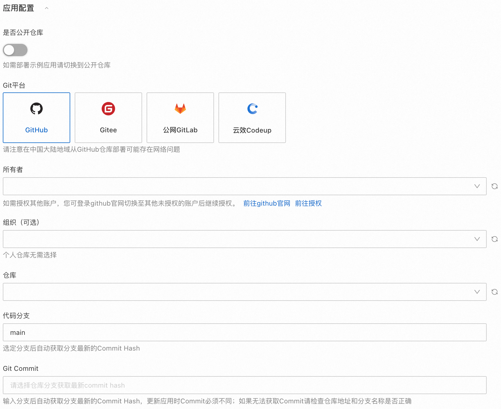
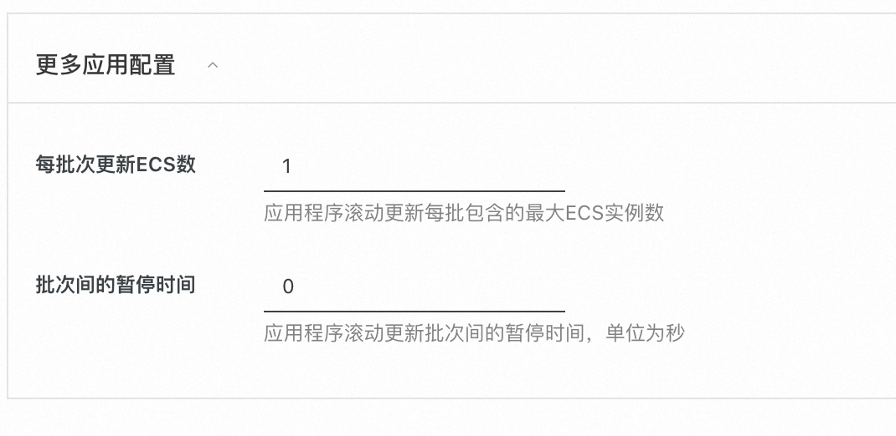

# Docker Web Service应用模板

此应用模板帮助您在阿里云上快捷部署符合最佳实践的Docker Web Service应用。支持部署高可用的生产应用和单实例的日常测试应用。

## 部署入口
1. 从应用管理首页->创建应用->快捷创建->通过应用模板创建，选择Docker Web Service应用模板，点击正式创建。将会创建一个新应用和一个应用分组。
2. 在已有应用里，点击右上角“创建应用分组”->快捷创建->通过应用模板创建,选择Docker Web Service应用模板。将会创建一个新应用分组。

### 部署步骤和输出
请参照页面提示填入参数，点击创建后，应用分组进入部署中状态。在部署成功后，可以查看应用分组的输出信息，包括：
1. 应用域名：点击从浏览器访问您的web服务
2. 应用安装位置：如果您想查看您的源代码，可以登录ECS实例，找到应用安装目录查看
3. 数据库环境变量文件位置：此文件中保存了数据库账号的用户名、密码以及数据库的地址。

##  提供您的Docker Web Service应用程序
此应用模板支持指定一个Git仓库的分支来部署应用程序。如果是私有仓库需要先授权应用管理访问您的Git仓库。
应用管理将在您的ECS实例中克隆Git仓库后启动docker应用。支持Github、Gitee等平台，注意在国内地域部署，从GitHub克隆代码有可能失败。


您的Docker Web Service应用的源代码项目需要满足以下条件：
1. 在根目录包含docker compose配置文件（compose.yaml或compose.yml、docker-compose.yaml、docker-compose.yml）。
2. 如果compose.yaml中依赖本地build的docker镜像，需要将build相关的文件一并包含在项目中，比如DockerFile
   
应用将使用`docker compose up -d`命令在ECS实例上启动您的Docker应用。由于docker应用是异步启动的，在部署完成后可能需要等待一段时间才能够访问Web服务。

### Docker compose介绍
Docker compose是一种容器编排工具，可以支持启动多个容器。如果您的应用原先是使用单容器运行的，改成使用Docker compose运行也非常简单。您可以参考以下文档了解docker compose：
- [Docker compose官方指南(英文)](https://docs.docker.com/compose/)
- [Compose file reference(英文)](https://docs.docker.com/compose/compose-file/)

#### 一个单容器的compose.yaml示例
```yaml
services:
  # 服务名，可以有多个服务
  webapp:
    # docker镜像
    image: "aliyun-computenest-opensource-registry.cn-hangzhou.cr.aliyuncs.com/default/nginx:20240625"
    # 端口映射，容器内80端口映射到主机的5000端口
    ports:
      - "5000:80"
    # 存储卷挂载，将主机的./static目录挂载到容器/usr/share/nginx/html
    volumes:
      - ./static:/usr/share/nginx/html
```

将此文件保存为/root/compose.yaml; 执行echo "Hello World" > /root/static/index.html，然后在/root目录执行`docker compose up -d`启动应用。(/root可以换成您的工作目录)
打开http://localhost:5000访问应用服务。


#### 多容器的compose.yaml示例
您可以参考此示例应用：https://gitee.com/betabao/docker-web-app
此应用中包含一个本地Dockerfile构建出的Python flask web容器和一个redis容器。启动后，每次访问网页会将redis中存储的访问计数加一，并打印次数到网页。


## 如何在Docker应用中访问数据库
如果您选择部署了数据库，数据库的访问信息会存储到环境变量文件中：/opt/applicationmanager/env/database.env

此环境变量文件的格式入下：
```
DATABASE_HOST=rm-xxxxxxx.mysql.rds.aliyuncs.com
DATABASE_PORT=3306
DATABASE_USERNAME=username
DATABASE_PASSWORD=password
```
在compose.yaml中，可以通过env_file属性，设置容器的环境变量。

```yaml
services:
  webapp:
    image: "you-web-app-image"
    # 将数据库环境变量文件导入到容器，代码中可以读取环境变量获取数据库的地址和账户、密码
    env_file:
      - ../env/database.env
```
然后您的应用程序代码就可以读取环境变量获取数据库的地址和账户、密码，访问数据库。

## 部署架构
此应用模板支持两种部署架构，单实例模式和高可用模式。
1. 单实例模式会创建一台带公网IP的ECS，在此ECS实例上部署docker web service应用。可选部署一个RDS数据库。用户通过公网IP访问web服务。单实例模式适合作为开发测试环境。
2. 高可用模式会创建一台或多台ECS实例并加入到弹性伸缩组，并关联弹性伸缩组和应用负载均衡器ALB实例。可选部署一个RDS数据库。用户通过ALB实例的域名访问web服务。高可用模式适合作为生产环境。

RDS数据库的连接信息（数据库地址、用户名、密码）会保存到一个环境变量文件中，您可以在compose.yaml中引入环境变量文件，就可以在应用代码中读取环境变量的值、访问数据库。

#### 单实例模式的架构图


#### 高可用模式的架构图


## 滚动更新应用程序
在应用分组部署完成后，支持更新应用程序。更新程序的入口，在应用分组概览页->修改配置->更新应用程序。

和部署应用类似，支持指定Git仓库分支来更新应用程序。更新时最新的Commit必须发生变化，即更换了代码分支或者原分支有新的Commit。

用户可以指定滚动更新的设置，包括每个更新批次包含的ECS实例个数和更新批次的间隔时间。


**注意**：更新应用期间请勿对应用或资源进行任何操作。由于docker应用是异步启动的，在部署完成后可能需要等待一段时间才能够访问Web服务。

## 修改部署配置
1. Docker Web Service应用模板支持修改资源的部分配置。更新程序的入口，在应用分组概览页->修改配置->修改部署配置。
2. 应用模板的参数中包含核心的资源配置，其他资源配置采用默认值。如果您需要修改资源配置，比如配置弹性伸缩的自动伸缩规则或者修改ALB的配置，您可以从资源管理页找到云资源后跳转到云服务控制台手动修改。